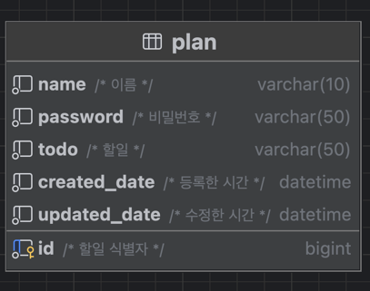

# Planner CRUD API (Spring Boot 학습)

## 요구사항
0. API 명세서 작성하기
   * equest 및 response는 json 형태
1. 일정 생성 및 조회
   * 할일, 작성자명, 비밀번호, 작성/수정일 저장
   * 전체 일정 조회, 선택 일정 조회(작성자명, 수정일)
2. 일정 수정 및 삭제
   * 수정 요청 시 비밀번호 함께 전달
   * 할일, 작성자명만 수정
---
## 주요 기능
* 계획생성, 조회, 수정, 삭제 (CRUD)
* Java 17 / Spring Boot 3.4.5 사용
---
## DB 설계

---
## API 명세서
[API 명세서](https://documenter.getpostman.com/view/44705343/2sB2qUm4TR)

## 트러블슈팅 기록
[블로그 바로가기](https://ung9776.tistory.com/68)